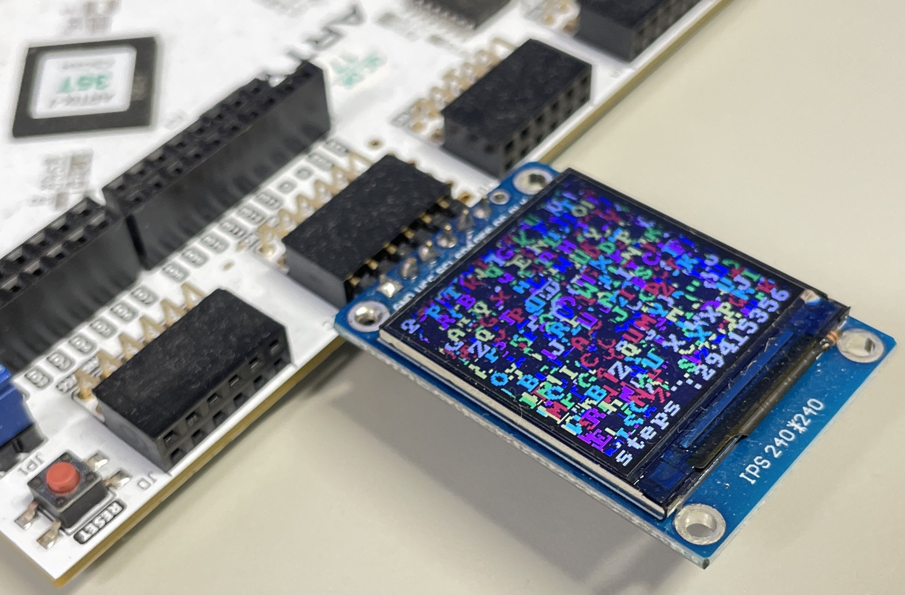

# CFU Proving Ground
CFU Proving Ground is a hardware-software co-design environment for FPGAs based on the RISC-V architecture.
This enables agile development of ASIPs (Application-Specific Integrated Products) through a soft processor supporting the RV32IM instruction set, an RTL-based design flow, and a CFU (Custom Function Unit), which is a resource-efficient ALU-based accelerator.

For information on how to create and use Custom Function Units (CFUs), please see [CFU Implementation Guide](cfu.md).

The recommended OS is Ubuntu Linux.
This project has been verified using Vivado 2024.2.

## Step (1) : Install the required software

If you are using [ACRi Room](https://gw.acri.c.titech.ac.jp/wp/), these software are already installed and you can skip this step.

For RTL simulation, install Verilator version 5 if it is not installed.
See the [Verilator website](https://www.veripool.org/verilator/) for more information.

As an FPGA development tool, install Vivado 2024.2 if it is not installed. 
See the  [Vivado site](https://www.amd.com/ja/products/software/adaptive-socs-and-fpgas/vivado.html) for more information.

Our display simulator uses libcairo-deb package, please install it with the following command.
```
$ sudo apt -y install libcairo-dev
```

Please install the RISC-V compiler with the following commands. Installing the compiler can take a long time, so if you don't need it, just skip this.
```
$ sudo apt -y install autoconf automake autotools-dev curl python3 libmpc-dev
$ sudo apt -y install libmpfr-dev libgmp-dev gawk build-essential bison flex texinfo
$ sudo apt -y install gperf libtool patchutils bc zlib1g-dev libexpat-dev
$ git clone https://github.com/riscv-collab/riscv-gnu-toolchain
$ cd riscv-gnu-toolchain
$ ./configure prefix=/tools/cad/riscv/rv32ima --with-arch=rv32ima --with-abi=ilp32
$ make
```

## Step (2) : Clone the repository and edit the environment variables

Please clone this repository with the following command.
```
$ git clone https://github.com/archlab-sciencetokyo/CFU-Proving-Ground
```

Open and edit the `Makefile` on the CFU-Proving-Ground directory to specify proper absolute paths.

If you are using [ACRi Room](https://gw.acri.c.titech.ac.jp/wp/), these paths are already set correctly and you do not need to change them.

| variable   |  path to                     |
| -----------| -----------------------------|
| GCC        | riscv32-unknown-elf-gcc      |
| GPP        | riscv32-unknown-elf-g++      |
| OBJCOPY    | riscv32-unknown-elf-objcopy  |
| OBJDUMP    | riscv32-unknown-elf-objdump  |
| VIVADO     | vivado                       |
| RTLSIM     | verilator                    |

## Step (3) : RTL simulation of main.c on a RISC-V processor with display emulator
This project uses Verilator and a custom display emulator.
The following command is used to compile the project.
```
$ cd CFU-Proving-Ground
$ make
```

The simulation with the display emulator is executed with the following command.
```
$ make drun
```


The simulation will not finish. Please press Ctrl + C in the terminal to end the simulation.

## Step (4) : Run the RISC-V processor on an FPGA board

Memory initialization files `memi.txt` and `memd.txt` are compiled from `main.c` with the following command.
```
$ make prog
```

The default FPGA board is Arty A7. 
If you want to use Nexys A7, modify `Makefile` to use `TARGET=nexys_a7`.
If you want to use Cmod A7, modify `Makefile` to use `TARGET=cmod_a7`.

Copy the proper `main.xdc` and `build.tcl` using the following command.
This initialization is necessary once.
```
$ make init
```

Generate a bitstream file with the following command:
```
$ make bit
```
The generated bitstream file is copied in `build/main.bit`.
Configure and run FPGA with this `main.bit`.
When the FPGA is configured, an application displays many random characters, similar to the simulation.

Note that a mini display (ST7789 TFT LCD) should be appropriately connected to the Pmod JC of Arty A7-35T FPGA board.



This [site](https://github.com/kisek/fpga_arty_a7_st7789) will explain the way to connect a mini display to Arty A7-35T FPGA board.


## Memory Map
The default memory map is shown below.
The sizes of instruction memory and data memory can be changed in `config.vh`.
If you change the size of the data memory, please appropriately modify the LENGTH of dmem in `app/link.ld`.

| addr   |  description                     |
| -----------| -----------------------------|
| 0x00000000 - 0x00007FFF | 32KiB Instruction Memory     |
| 0x10000000 - 0x10003FFF | 16KiB Data Memory            |
| 0x20000000 - 0x2000FFFF | 64KiB Video Memory    |
| 0x40000000 | performance counter control (0: reset, 1: start, 2: stop)|
| 0x40000004 | mcycle                  |
| 0x40000008 | mcycleh                 |
| 0x80000000 | tohost (for simulation) |

## Write a bitstream
When using the Vivado Hardware Server, you can use `scripts/prog_dev.tcl`.

In `scripts/prog_dev.tcl`, please specify the IP ADDRESS and PORT number of the host where the Vivado Hardware Server is running.
Once the specification is complete, you can write the bitstream to the board with `make conf`.

## History
2025-07-09 Ver 1.7.3:
- Divider bug has been fixed.

2025-07-02 Ver 1.7.2:
- IMEM/DMEM memory size bug has been fixed.

2025-06-16 Ver 1.7.1:
- Fixed a bug in the ALU.

2025-06-04 Ver 1.7:
- Verilog files have been formatted.
- CFU supported HLS.

2025-06-03 Ver 1.6:
- Revised some descriptions for VCC.

2025-05-09 Ver 1.5:
- Improved RVProc clock speed to 180 MHz.
- Added CFU.md describing how to use the cfu.v.

2025-05-01 Ver 1.4:
- Fixed a bug in the branch predictor.
- Improved Fmax of RVProc from 160MHz to 175MHz.

2025-04-24 Ver 1.3:
- Default configuration of `IMEM_SIZE` has been changed 64KiB to 32KiB.
- We have improved BRAM that was deleted during optimization.
- Jitter Optimization of the clocking wizard has been changed.

2025-04-11 Ver 1.2:
- The tcl script has been modified so that the operating frequency can be set from config.vh.
- A script that automatically writes the bitstream to the board has been added (`Make conf`).

2025-04-07 Ver 1.1:
- CFU now supports stall_o signals.

2025-03-31 Ver 1.0:
- CFU Proving Ground has been published.

2025-03-26 Ver 0.5:
- The function names in the Proving Ground library have been changed.
- The timing of writing to data memory has been changed from the MA stage to the EX stage.

2025-03-24 Ver 0.4:
- The memory map has been changed.
- We changed from Princeton architecture to Harvard architecture.
- The timing of writing to data memory has been changed from the EX stage to the MA stage.
- `perf_instret()` has been removed.

2025-03-04 Ver 0.3:
- The default application has been changed.
- Changed vmem to 3bit RGB.

2025-03-03 Ver 0.2:
- Fixed to allow changing display direction in `config.vh`.
- We have decided not to support transparent colors.
- Removed `st7789_printf()` and added `LCD_prints()`.
- The method was changed to specify the absolute path in the `Makefile`.
- The g++ compiler is now supported.
- When generating bitstream, the existence of `sample1.txt` is checked.
- Moved `build.tcl` to the home directory.
- The directory `prog` has been changed to `app`.
- Added license file.
- Added a brief explanation to the README.md.
- Changed to use the display emulation with `make drun`.
- In addition to the Nexys A7, we now support the Arty A7.
- Changed Nexys A7 and Arty A7 to not use Clock Wizard.

2025-02-20 Ver.0.1:
- initial version
